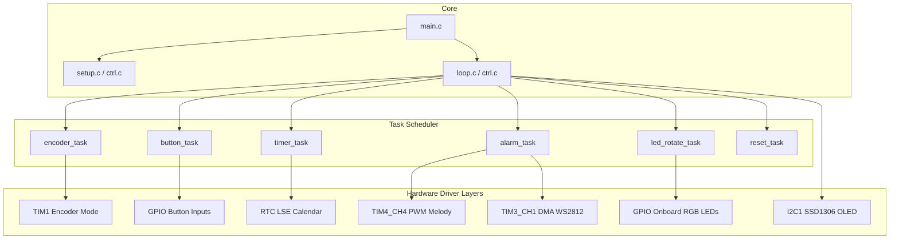
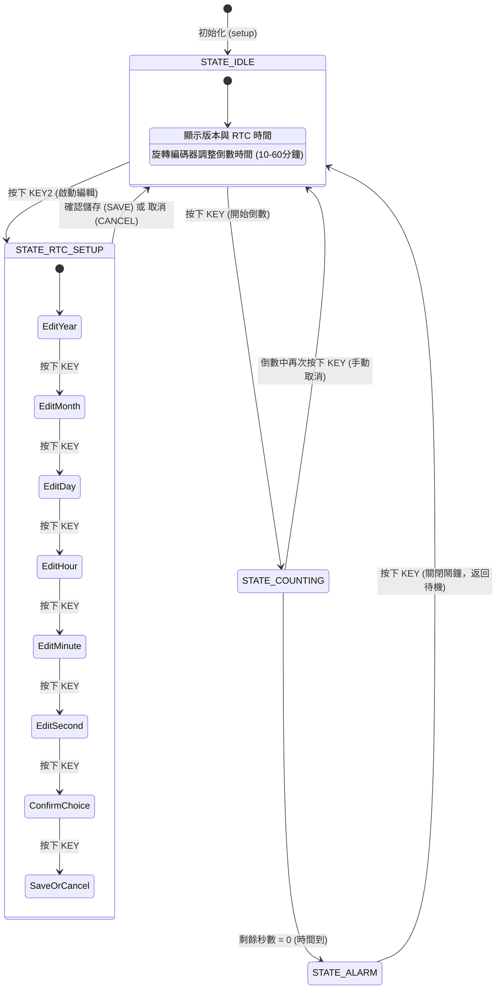

# 喝水提醒裝置 - STM32F103C8T6

[](https://docs.baud-dance.com/docs/stm32/intro/)
[](https://www.st.com/zh/embedded-software/stm32cubef1.html)
[](https://opensource.org/licenses/MIT)

## 專案簡介 / Project Overview

本專案是一個基於 **KEYSKING STM32F103C8T6 學習板** 開發的**智慧喝水提醒裝置**。該裝置利用狀態機設計，支援透過旋轉編碼器靈活設定倒數時間，並在 OLED 顯示器上即時回報狀態。當時間到時，蜂鳴器會播放經典提示樂曲，同時 WS2812B 燈條同步輸出彩虹動態特效，提醒使用者定時補充水分。

裝置另整合了內部 RTC（Real Time Clock）日曆顯示，支援直接透過硬體按鍵與編碼器進入設定畫面，以年、月、日、時、分、秒的精度動態調校系統時間，具備完整的儲存/取消寫入機制。

---

## 系統架構與狀態機 / System Architecture & State Machine

整個系統基於分時任務輪詢架構，在主循環 [loop](file:///Users/mic/Projects/STM32/F103C8_oled_260528/Core/Src/ctrl.c#L721) 中調度各項硬體處理模組，並透過核心狀態機 [SystemState_t](file:///Users/mic/Projects/STM32/F103C8_oled_260528/Core/Src/ctrl.c#L18-L24) 來管理當前的運作狀態。

### 1. 系統架構圖


### 2. 狀態機轉移圖 (State Transition Diagram)
系統共維護四種核心狀態：
- `STATE_IDLE` (待機狀態)
- `STATE_RTC_SETUP` (RTC 設定狀態)
- `STATE_COUNTING` (倒計時狀態)
- `STATE_ALARM` (提醒鬧鐘狀態)



---

## 硬體配置與引腳映射 / Hardware Configuration

本專案使用晶片為 **STM32F103C8T6** (LQFP48 封裝)，工作頻率為 72MHz。

| 功能模組 | 引腳 (Pin) | 模式 / Configuration | 作用描述 |
| :--- | :--- | :--- | :--- |
| **系統時鐘 (HSE)** | PD0-OSC_IN / PD1-OSC_OUT | 外部高速晶振 (8 MHz) | PLL 倍頻後作為 72 MHz 系統主時鐘 |
| **RTC 時鐘 (LSE)** | PC14-OSC32_IN / PC15-OSC32_OUT | 外部低速晶振 (32.768 kHz) | 用作 RTC 時鐘源，保證計時精準與低功耗備用 |
| **OLED 顯示器** | PB6 (I2C1_SCL) / PB7 (I2C1_SDA) | I2C Fast Mode (400kHz) | 連接 128x64 SSD1306 OLED，負責各介面渲染 |
| **蜂鳴器 (Buzzer)** | PB9 (TIM4_CH4) | PWM 輸出 (基頻由音符頻率動態計算) | 負責播放提示音樂，20% 佔空比驅動被動蜂鳴器 |
| **旋轉編碼器** | PA8 (TIM1_CH1) / PA9 (TIM1_CH2) | 雙通道正交解碼 (TIM Encoder Mode - TI2) | 用於數值調整（提醒分鐘數與 RTC 數值欄位） |
| **操作鍵 (KEY)** | PB15 | GPIO Input (Pull-up, 上拉輸入) | 旋轉編碼器按鍵，用以啟動/暫停倒數、RTC 步進 |
| **重置鍵 (KEY1)** | PB12 | GPIO Input (Pull-up, 上拉輸入) | 系統軟體重置按鍵，觸發 `HAL_NVIC_SystemReset()` |
| **設定鍵 (KEY2)** | PB13 | GPIO Input (Pull-up, 上拉輸入) | 待機狀態下按下以進入 RTC 設定模式 |
| **WS2812 燈效** | PB4 (TIM3_CH1) | TIM PWM (800kHz) + DMA1 Channel 6 (Normal) | 輸出高精準度時序信號驅動 10 顆 WS2812 彩色燈條 |
| **板載 RGB LED** | PB0 (RED) / PA7 (GREEN) / PA6 (BLUE) | GPIO Output (Active Low, 低電平點亮) | 倒數狀態下，每秒以 紅 -> 綠 -> 藍 輪流點亮 |
| **除錯串口 (UART2)** | PA2 (USART2_TX) / PA3 (USART2_RX) | 異步模式 115200 8N1 | 重導向 `printf` 至串口輸出，便於調試 |

---

## 核心外設配置技術細節 / Peripheral Technical Specifications

### 1. WS2812B 驅動時序設計
WS2812B 數據傳輸速度為 800kHz (1.25 µs 每位元)。
本專案利用 `TIM3` 的時脈頻率 72MHz，並設定週數值為 `90-1`。
- 計算傳輸頻率： $72 \text{ MHz} / 90 = 800 \text{ kHz}$ (即一個位元週期佔 90 個計數器刻度)。
- **二進制 0 碼** (CODE_ZERO_DUTY)：設定脈寬為 21，佔空比約為 $21/90 \approx 23.3\%$ (高電平持續 $\approx 290\text{ ns}$，符合 WS2812 時序)。
- **二進制 1 碼** (CODE_ONE_DUTY)：設定脈寬為 66，佔空比約為 $66/90 \approx 73.3\%$ (高電平持續 $\approx 920\text{ ns}$，符合 WS2812 時序)。
- **復位信號** (RST_PERIOD_NUM)：發送 100 個週期的低電平信號作為 Reset，並搭配 `DMA1_Channel6` 記憶體到外設傳輸，保證發送時序完全硬體化、不佔用 CPU 資源。

### 2. TIM4 蜂鳴器頻率動態調校
被動蜂鳴器發聲原理為透過改變 PWM 的頻率（即 ARR 自動重載暫存器）來產生不同音調的方波：
- 系統定時器 `TIM4` 配置預分頻值 (PSC) 為 `72-1`，故計數頻率為 $72 \text{ MHz} / 72 = 1 \text{ MHz}$。
- 當播放音符 $F$ (以 Hz 為單位) 時，自動重載值計算法： $\text{ARR} = 1,000,000 / F$。
- 設定脈寬比較值 $\text{CCR} = \text{ARR} / 5$ (即 20% 佔空比)，確保音色溫和不刺耳。

### 3. RTC (LSE + Backup Region)
- 時鐘源：採用 32.768kHz 外部低速晶振 (LSE)，經過 32768 分頻得到 1 秒的 RTC 計時基本頻率。
- 數據儲存：以 Unix 時間戳（秒數）形式寫入 `RTC_CNT`，並以 `struct tm` 結構轉化為常規日曆。
- 備份暫存器：透過備份域暫存器 `RTC_BKP_DR1` 存儲初始化標誌 `0x2333`。若晶片未斷電且備份域未遺失，則系統重啟時不會重置已經設定好的時間。

---

## 專案目錄結構 / Directory Structure

本專案主要模組與建置檔案分布如下：

```text
F103C8_oled_260528/
├── Core/
│   ├── Inc/
│   │   ├── ctrl.h        # 狀態控制與主任務調度頭文件
│   │   ├── kk_rtc.h      # RTC 時間讀寫封裝頭文件
│   │   ├── music.h       # 蜂鳴器播放與音符定義
│   │   ├── ws2812.h      # WS2812 DMA 控制定義
│   │   ├── rs232.h       # 序列埠與 printf 導向定義
│   │   ├── main.h        # GPIO 與外設引腳定義
│   │   └── rtc.h, tim.h, usart.h, dma.h, gpio.h # HAL 外設硬體頭文件
│   └── Src/
│       ├── main.c        # 系統入口點，呼叫 setup() 與 loop()
│       ├── ctrl.c        # 主狀態機、按鍵防抖、時間計算與 OLED 介面渲染
│       ├── kk_rtc.c      # 封裝讀寫 RTC 暫存器與 Unix 時間轉換
│       ├── music.c       # 定時器 PWM 音符頻率更新與《莫愁小姿》曲譜數據
│       ├── ws2812.c      # WS2812 彩虹色彩與 DMA 發送函式
│       ├── rs232.c       # UART 發送/接收與 _write (stdout 重新導向)
│       ├── stm32f1xx_it.c# 中斷服務常式 (ISR)
│       └── rtc.c, tim.c, usart.c, dma.c, gpio.c # HAL 外設初始化實現
├── Drivers/              # STM32 HAL 庫與 CMSIS 底層驅動
├── cmake/                # CMake 交叉編譯與 STM32CubeMX 自動生成腳本
├── CMakeLists.txt        # 專案 CMake 建置配置
├── CMakePresets.json     # CMake 編譯預設配置
├── STM32F103XX_FLASH.ld  # 連結器腳本 (定義 Flash 與 SRAM 佈局)
└── README.md             # 本說明文件
```

> [!NOTE]
> 專案中的 OLED 驅動與基礎字模檔案位於同級目錄的 `../shared_libs` 中（包括 `font.c` 與 `oled.c`），編譯時透過 [CMakeLists.txt](file:///Users/mic/Projects/STM32/F103C8_oled_260528/CMakeLists.txt#L48-L61) 自動引入其包含路徑與源代碼。

---

## 核心源碼文件導覽 / Source Code Navigation

若要深入理解專案，請參閱以下原始碼檔案：
- **控制核心與介面渲染**：[ctrl.c](file:///Users/mic/Projects/STM32/F103C8_oled_260528/Core/Src/ctrl.c) — 包含狀態機切換、按鍵掃描 [button_task](file:///Users/mic/Projects/STM32/F103C8_oled_260528/Core/Src/ctrl.c#L447)、編碼器阻尼累加器 [encoder_task](file:///Users/mic/Projects/STM32/F103C8_oled_260528/Core/Src/ctrl.c#L397) 與 RTC 設定畫面繪製 [update_oled_rtc_setup](file:///Users/mic/Projects/STM32/F103C8_oled_260528/Core/Src/ctrl.c#L245)。
- **RTC 驅動模組**：[kk_rtc.c](file:///Users/mic/Projects/STM32/F103C8_oled_260528/Core/Src/kk_rtc.c) — 實作底層的初始化 [KK_RTC_Init](file:///Users/mic/Projects/STM32/F103C8_oled_260528/Core/Src/kk_rtc.c#L137)、時間戳讀取 [KK_RTC_GetTime](file:///Users/mic/Projects/STM32/F103C8_oled_260528/Core/Src/kk_rtc.c#L132) 與寫入功能 [KK_RTC_SetTime](file:///Users/mic/Projects/STM32/F103C8_oled_260528/Core/Src/kk_rtc.c#L123)。
- **音樂發聲模組**：[music.c](file:///Users/mic/Projects/STM32/F103C8_oled_260528/Core/Src/music.c) — 提供非阻塞式的樂譜輪詢撥放函式 [play_music](file:///Users/mic/Projects/STM32/F103C8_oled_260528/Core/Src/music.c#L210) 與音符頻率映射。
- **WS2812 炫彩模組**：[ws2812.c](file:///Users/mic/Projects/STM32/F103C8_oled_260528/Core/Src/ws2812.c) — 包含基於 HSV/RGB 彩虹色彩算法的 [ws2812_rainbow](file:///Users/mic/Projects/STM32/F103C8_oled_260528/Core/Src/ws2812.c#L163) 及 DMA 更新函式。
- **串口重導向模組**：[rs232.c](file:///Users/mic/Projects/STM32/F103C8_oled_260528/Core/Src/rs232.c) — 提供 `_write` 的複寫實現，將 `printf` 導流至 `USART2`。

---

## 建置與燒錄 / Build & Flash Guide

本專案支援使用 CMake 和 arm-none-eabi-gcc 工具鏈進行編譯。

### 1. 編譯準備工作
確保本機已安裝：
- CMake (版本 $\ge 3.22$)
- Ninja 建置工具 (選用，但推薦)
- Arm GCC Toolchain (`arm-none-eabi-gcc`)

### 2. 使用命令列編譯 (CMake & Ninja)
在專案根目錄下，依序執行以下命令：
```bash
# 1. 建立並配置 Debug 編譯目錄
cmake -DCMAKE_BUILD_TYPE=Debug -B build/Debug -G Ninja

# 2. 進行編譯
cmake --build build/Debug
```
編譯完成後，將在 `build/Debug/` 目錄下生成可執行文件：
- 核心燒錄檔：`F103C8_oled_260528.elf`
- 生產燒錄檔：`F103C8_oled_260528.bin` / `F103C8_oled_260528.hex`

### 3. 燒錄與除錯 (CLI)
可使用 OpenOCD 或 ST-Link Utility 將二進位檔燒錄到板載晶片中：
```bash
# 使用 OpenOCD 透過 ST-Link 燒錄
openocd -f interface/stlink.cfg -f target/stm32f1x.cfg -c "program build/Debug/F103C8_oled_260528.elf verify reset exit"
```

---

## 故障排除 / Troubleshooting Guide

| 異常現象 | 可能原因 | 建議排查步驟 |
| :--- | :--- | :--- |
| **OLED 螢幕全黑** | 1. I2C 連線鬆脫或 SCL/SDA 接反<br>2. 缺乏外部上拉電阻<br>3. 供電電壓不穩（應為 3.3V） | - 用示波器或邏輯分析儀測量 PB6/PB7 是否有時鐘和數據信號<br>- 檢查硬體接線並確認 OLED 地址是否為預設的 0x78 |
| **旋轉編碼器無反應或無方向性** | 1. TIM1 未成功啟動編碼器計數模式<br>2. PA8/PA9 接線損壞<br>3. 編碼器信號抖動過大 | - 檢查 [ctrl.c](file:///Users/mic/Projects/STM32/F103C8_oled_260528/Core/Src/ctrl.c#L694) 中 `HAL_TIM_Encoder_Start` 是否正確執行<br>- 加裝 104 旁路電容對編碼器進行硬體濾波 |
| **鬧鐘響起時蜂鳴器無聲音** | 1. `TIM4` 比較暫存器配置不正確<br>2. 蜂鳴器非被動式或引腳 PB9 未設定為複用推挽輸出 | - 測量 PB9 引腳在提醒狀態下是否輸出了相應頻率的 PWM 方波<br>- 確認蜂鳴器為「被動式蜂鳴器」（需要交流頻率驅動），主板上的跳線帽是否正確插上 |
| **WS2812 燈條不亮或顏色異常** | 1. 驅動電壓低於 5V（WS2812 供電最好為 5V）<br>2. TIM3 DMA 設定與代碼配置時序不符 | - 確保燈條 VCC 接在 5V 電源上而非 3.3V<br>- 檢查 `CODE_ONE_DUTY` 與 `CODE_ZERO_DUTY` 暫存器數值是否被意外修改 |
| **每次斷電重開後 RTC 時間重置** | 未接入備份電池（VBAT 引腳未供電），或 `RTC_BKP_DR1` 未正確寫入標誌 | - 在 KEYBOARD/LEARNING Board 的 VBAT 插針上接上 CR1220 鈕扣電池<br>- 確保 `KK_RTC_Init` 流程正常運作 |

---

## 版本資訊 / Versioning

- **目前版本**：v0.8
- **最後修訂日期**：2026-06-22
- **維護者**：mic (STM32 Embedded Developer)
- **授權協議**：MIT License
